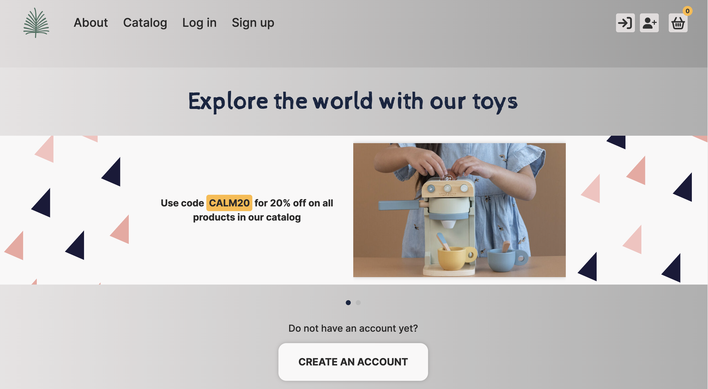

<h1 align="center">
    eCommerce-Application
</h1>
<br>
    <div align="center">
        
    </div>

<h3 align="left">
    Team: Keep Calm and Code
</h3>
<br>
Welcome to our eCommerce Application! This project is a team task in which our team of three students of RS School develop an eCommerce application.
<br>
<h2 align="left">
    [Deploy Link](https://keep-calm-and-code.netlify.app/)
</h2>

## About project
Our platform recreates real-life shopping experiences in a digital environment. It is a complete online store that provides an interactive and seamless user experience. 

From product search to placing an order, the app provides a seamless journey for the user, improving engagement and increasing shopping confidence.

We wish you successful shopping and a pleasant user experience!

### Project goals
The main goal of the project is to explore the use of front-end technologies and provide a convenient platform for purchasing goods, specifically:

- Explore sign-in/sign-up systems and create registration/login forms
- Integrate the CommerceTools into project
- Implement of a product catalog, detailed product description and user profile page
- Implement of a product cart and promocodes
- Create product detail page for every item


### Project structure
This application includes several key pages:
- Sign In page
- Sign Up page
- Main page
- Catalog page
- Product page
- Profile page
- Cart page
- About Us page
- 404 (Not Found) page

### Project developers team
- [pambaka](https://github.com/pambaka)
- [gunsnfnr](https://github.com/gunsnfnr)
- [tmaltseva](https://github.com/tmaltseva)

### Technology stack
<div style="display: flex; gap: 10px;">
    
    
    
    
    
    
</div>

### Scripts
`lint`: to lint your code.\
`format`: to format your code.\
`ci:format`: to check code format compliance in CI.\
`test`: to run tests once.\
`test:watch`: to run tests in observation mode.\
`test:coverage`: to run tests and generates a code coverage report.

### Project Installation
```sh
## Clone the project repository to your computer:
git clone https://github.com/pambaka/eCommerce-Application.git

## Change the current working directory
cd ecommerce-application

## Install project dependencies with the command: 
npm install
```

### Project prepare
```sh
## To install git hooks automatically:
npm run prepare
```

### Project build
```sh
## To build the project run the following command using npm:
npm run-build

## and using yarn:
yarn build
```